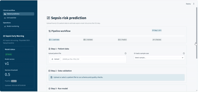
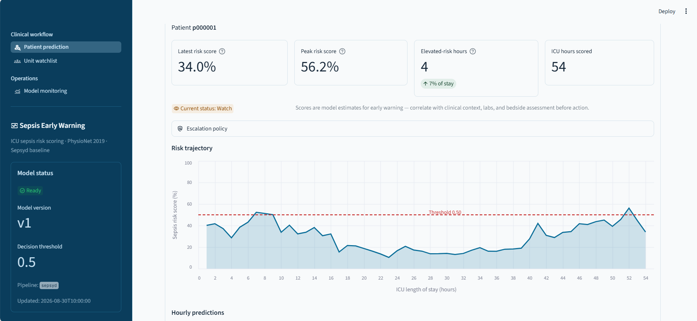
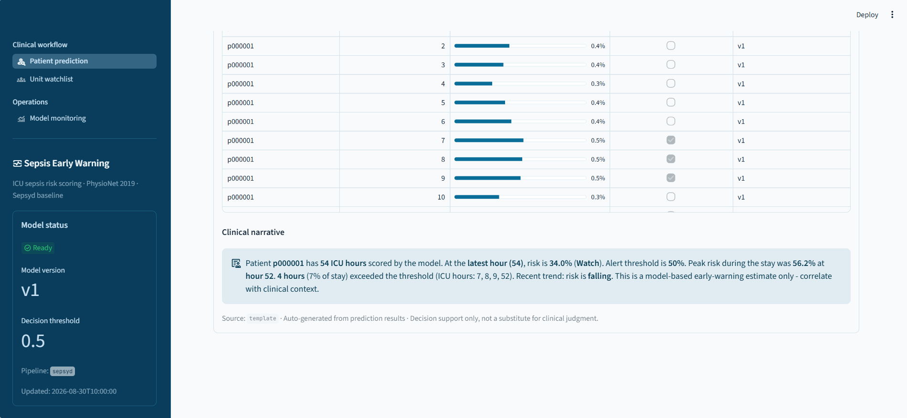

# AIO-Microwave-Sepsis

> Dự án: Dự đoán sớm sepsis từ dữ liệu lâm sàng ICU.




## Tính năng chính

- **Streamlit app**: upload `.psv`/`.csv`, dự đoán nguy cơ sepsis theo thời gian thực.
- **Tường thuật LLM tự động**: sau khi predict, app tự gọi Gemini để diễn giải kết quả bằng tiếng Việt.
- **Model gốc Sepsyd** đã chuyển từ pickle XGBoost 0.90 sang XGBoost JSON portable, chạy được trên XGBoost hiện đại.
- **Airflow retraining pipeline**: tự động train, đánh giá và promote model mới (pipeline `team_v1`) mà không cần sửa code app.
- **Đang reproduce baseline** theo đúng mô tả thuật toán trong paper gốc (xem `reproduce/`).

## Quickstart

```bash
pip install -r requirements.txt
python scripts/bootstrap_artifacts.py   # tạo artifacts/models/v1 + current_model.json
streamlit run app/streamlit_app.py
```

Upload file `.psv`/`.csv`, hoặc chọn file mẫu trong `app/sample_data/`, rồi nhấn **Run Prediction**.



### Tường thuật LLM

Cấu hình key một lần trong `.streamlit/secrets.toml`:

```toml
GEMINI_API_KEY = "your-key"   # https://aistudio.google.com/apikey
```

Không có key hợp lệ → tự dùng template nội bộ, không cần cấu hình gì thêm trên UI. LLM trả lời bằng **tiếng Anh**.



## Dataset

Dữ liệu training (PhysioNet/CinC Challenge 2019) đóng gói sẵn trên Kaggle:
**https://www.kaggle.com/datasets/nguyenhoangthaotrinh/sepsyd-data**

Chi tiết features, format file, cách chấm utility score: [`DATASET_OVERVIEW.md`](DATASET_OVERVIEW.md).

## Trạng thái hiện tại

- MVP prediction app với pipeline `sepsyd` (model v1 gốc đã chuyển sang XGBoost JSON).
- Pipeline `team_v1` dùng trực tiếp artifact do DAG retraining tạo.
- Đã có nguồn dữ liệu training trên Kaggle — đang chạy `reproduce/reproduce_sepsis_baseline.ipynb` để reproduce baseline.

<details>
<summary><strong>Cấu trúc project</strong></summary>

- **`original/`** — mã nguồn **inference gốc của chính tác giả** (team Sepsyd), tải từ repo chính thức `physionetchallenges/2019ChallengeEntries`. Gồm `get_sepsis_score.py` (thuật toán inference), model XGBoost đã train sẵn (`f120d4e02n8010val434.pickle.dat`), `driver.py`, paper gốc kèm theo. Lưu ý: đây **chỉ có code inference, không có code training** — tác giả không công khai phần này.
- **`app/`** — Streamlit UI upload + dự đoán sepsis (MVP).
- **`src/inference/`** — Module inference: validator, model loader, pipeline sepsyd, prediction log.
- **`artifacts/`** — Model v1 + `current_model.json` manifest.
- **`reproduce/reproduce_sepsis_baseline.ipynb`** — nơi đang thực hiện việc **reproduce lại baseline** theo mô tả thuật toán trong paper (preprocessing, feature engineering, train XGBoost, đánh giá bằng utility score chính thức của Challenge).
- **`reproduce/PublishedPaperCinC2019-423.pdf`** — bản paper gốc.
- **`DATASET_OVERVIEW.md`** — tài liệu mô tả dataset PhysioNet Challenge 2019.
- **`requirements.txt`** — dependency cho reproduce + app (numpy, pandas, scikit-learn, xgboost, streamlit, pytest).

</details>

<details>
<summary><strong>Airflow retraining</strong></summary>

Khung retraining production nằm trong `src/pipelines/`, DAG tại `dags/sepsis_retraining_dag.py` và cấu hình tại `configs/retraining.yaml`.

Chuẩn bị asset trước khi chạy:

1. Đặt toàn bộ file `.psv` trực tiếp vào `data/raw/`.
2. Đặt batch mới cần retrain vào `data/incoming/`.
3. Cài dependency bằng `pip install -r requirements.txt`, cấu hình `PYTHONPATH` trỏ tới project root rồi khởi động Airflow.

DAG tạo lại train/test split theo patient ở mỗi lần retrain và lưu split metadata trong thư mục run. Sau mỗi lần retrain thành công, candidate được đăng ký và luôn thay thế model hiện tại trong `current_model.json`, không qua bước so sánh performance với model cũ.

Ứng dụng và DAG dùng chung `artifacts/current_model.json`. Trước lần retrain đầu, manifest trỏ tới pipeline `sepsyd`; sau khi promote, DAG atomically chuyển manifest sang pipeline `team_v1` và giao diện tự reload ở lần dự đoán tiếp theo.

</details>

<details>
<summary><strong>Testing</strong></summary>

```bash
python -m pip install -r requirements.txt
pytest tests/ -v
```

## Phân công thực hiện

| Vị trí | Phụ trách báo cáo | Deliverable kỹ thuật | Definition of Done |
|---|---|---|---|
| Leader | Mục 1, 2, 4, 8, 9; review toàn bộ | Scope, architecture, risk register, release plan, tích hợp các nhánh | Các thuật ngữ/metric/version nhất quán; không merge khi gate fail |
| Data | Mục 3.1 | Data contract, ingestion, EDA, split manifest, preprocessing/feature package | Schema + leakage tests pass; data card và snapshot hash đầy đủ |
| Model | Mục 3.2 và phần model trong Mục 5 | Baseline, XGBoost, tuning, calibration, threshold, SHAP, model card | Reproducible run; evaluation artifact; không chạm test trước khi freeze |
| QA/QC | Mục 6.1, 7 | Streamlit UI, timeline/explanation, error handling, audit hooks | Contract/UI tests pass; demo đủ valid/invalid/low-quality cases |
| Pipeline | Mục 6.2 | Monitoring, retrain orchestration, registry, champion–candidate gate, canary/rollback | Dry-run và rollback drill pass; artifact/version lineage đầy đủ |
| Cả nhóm | Review chéo và demo | README, video, presentation, incident drill | Hai người review mỗi PR có ảnh hưởng data/model/safety |

Test suite kiểm tra DAG import/topology trên Airflow 3, batch detection và Bronze ingestion, data quality gate, lookback theo từng bệnh nhân, performance gate, dataset registry và model promotion. Test không chạy huấn luyện XGBoost hoàn chỉnh nên có thể chạy nhanh trong quá trình phát triển.

</details>
